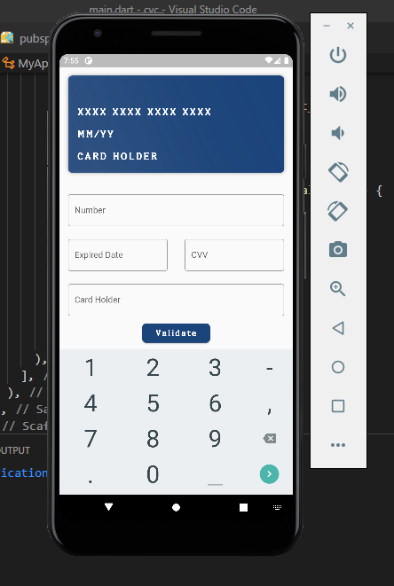
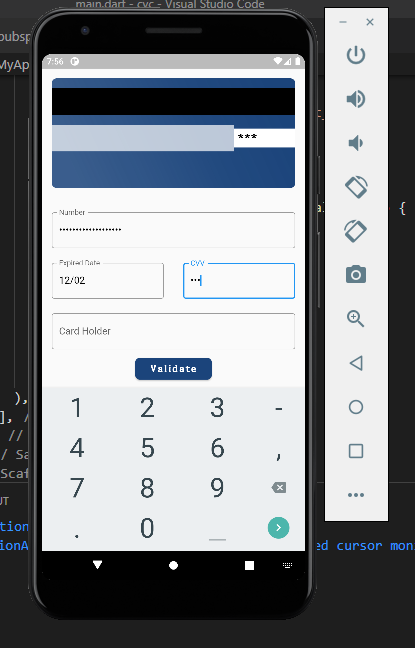
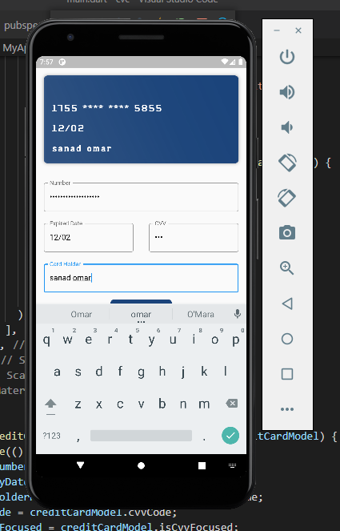

# TP1 FLUTTER CREDIT CARD UI 
<h3>FIRST step :</h3>
 
must enter the number of credit card then the expired date 
 

   
   

   <h3>SECONDE step :</h3>
 
you enter the CVV in the back of the card after she turn automatically  
 
 
   

   
   

   <h3>THIRD step :</h3>
 
you enter the first and last name of the card owner   
 
 
   

   
   

   => the you click valid
